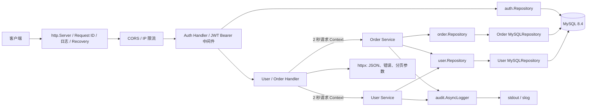

# 项目架构与依赖关系

`cmd/api/main.go` 是生产组合根：读取必填 `MYSQL_DSN`、建立并校验 MySQL 连接池、执行嵌入式向前迁移，然后将 MySQL 仓储注入 HTTP 应用。`newServer()` 只保留给内存仓储测试。

## 运行时调用链

## 启动与持久化

1. `main` 读取服务器超时和 `MYSQL_DSN`；DSN 缺失或数据库不可用时启动失败，不会回退到内存数据。
2. `database.Open` 建立 `database/sql` 连接池：最大连接 10、最大空闲 5、连接生命周期 30 分钟，并在 5 秒内完成 Ping。
3. `database.ApplyMigrations` 从二进制内嵌的 SQL 文件按文件名顺序执行尚未记录的迁移；DDL 成功后才写入 `schema_migrations`。迁移仅向前，遇错立即停止。
4. `main` 注入 `user.NewMySQLRepository`、`order.NewMySQLRepository` 和 `auth.NewMySQLRepository`。认证数据与业务数据使用同一个 MySQL 数据库；会话只存 Refresh Token 的 SHA-256 哈希。
5. 若同时配置 `BOOTSTRAP_ADMIN_EMAIL`、`BOOTSTRAP_ADMIN_PASSWORD`，启动时仅在邮箱不存在时创建管理员。优雅停机的实际关闭顺序为 HTTP → 审计日志 → 数据库连接池。

## 分层边界

- Handler 只处理 HTTP、请求超时、分页参数与 JSON 响应。
- Service 处理参数校验、业务规则及领域错误到 `httpx.AppError` 的转换。订单服务还负责状态机和仅在实际变化时写入审计事件。
- Repository 接口隔离存储实现；MySQL 仓储使用 `ExecContext`、`QueryRowContext`/`QueryContext`，内存实现仅服务测试。订单创建以 `orders.idempotency_key` 的唯一约束防止并发重试重复写入；状态流转以 `WHERE status = 'pending'` 的条件更新保证原子性。
- `order.Service` 通过 `UserFinder`（生产中为用户仓储）确认用户存在；外键冲突也会被转换为客户端可理解的“用户不存在”。
- `page.Request` 与 `page.Result[T]` 是存储无关的游标分页契约。查询按 `id ASC`，使用 `afterId` 和多取一条记录生成 `nextCursor`。
- `auth` 负责 bcrypt 密码、短期 HS256 Access JWT、Refresh 会话轮换和退出撤销；`principal` 平台包只承载请求身份上下文，避免认证模块与业务模块相互依赖。
- 普通用户只能读取自己的资料和订单；订单列表在仓储查询中按 `user_id` 过滤。`admin` 才能列出用户、跨用户查看订单或替其他用户创建订单。
- `security` 在 HTTP 外层执行精确 Origin CORS 和按 IP/路由类别的内存限流。生产 TLS 由反向代理终止，必须启用 `AUTH_COOKIE_SECURE=true`。

## 路由

| 路由 | 方法 | 成功响应 |
| --- | --- | --- |
| `/api/v1/health` | `GET` | `{ "status": "ok" }` |
| `/api/v1/auth/register` | `POST` | 注册、设置 Refresh Cookie、返回 Access Token，`201` |
| `/api/v1/auth/login` | `POST` | 登录、设置 Refresh Cookie、返回 Access Token，`200` |
| `/api/v1/auth/refresh` | `POST` | 轮换 Refresh 会话并返回新 Access Token，`200` |
| `/api/v1/auth/logout` | `POST` | 撤销 Refresh 会话，`204` |
| `/api/v1/auth/me` | `GET` | 当前用户公开资料 |
| `/api/v1/users` | `POST` / `GET` | 仅 `admin` |
| `/api/v1/users/:id` | `GET` | 本人或 `admin` |
| `/api/v1/orders` | `POST` | 已认证创建；普通用户自动绑定自身，`admin` 可指定用户 |
| `/api/v1/orders` | `GET` | 普通用户自己的订单；`admin` 全量 |
| `/api/v1/orders/:id`、`/pay`、`/cancel` | `GET` / `POST` | 订单所有者或 `admin` |

列表接口接受 `limit`（默认 20，范围 1–100）和正整数 `afterId`。没有下一页时省略 `nextCursor`。创建订单可选 `Idempotency-Key` 请求头：同键同参数重试返回首次订单，冲突返回 `IDEMPOTENCY_KEY_CONFLICT`。状态机只允许 `pending -> paid` 或 `pending -> cancelled`，跨终态操作返回 `INVALID_ORDER_STATE`。错误响应为 `{ "code": "稳定错误码", "error": "人类可读文案" }`；金额是人民币分整数，时间是 UTC RFC 3339。

## 外部依赖

- Go `1.25.3`
- `database/sql`
- `github.com/go-sql-driver/mysql`
- `github.com/golang-jwt/jwt/v5`
- `golang.org/x/crypto/bcrypt`
- MySQL `8.4`（本地由 `compose.yaml` 提供）

创建订单的持久化时序见：[订单创建时序图](images/order-create-sequence.svg)。
