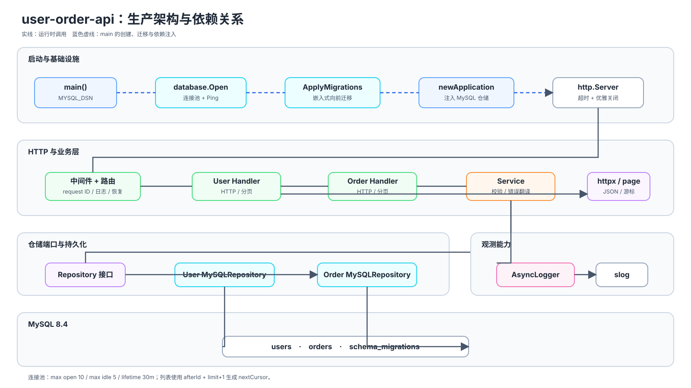
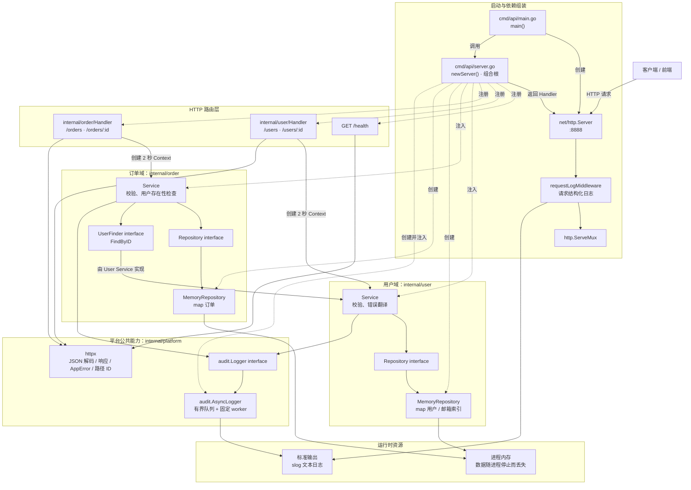
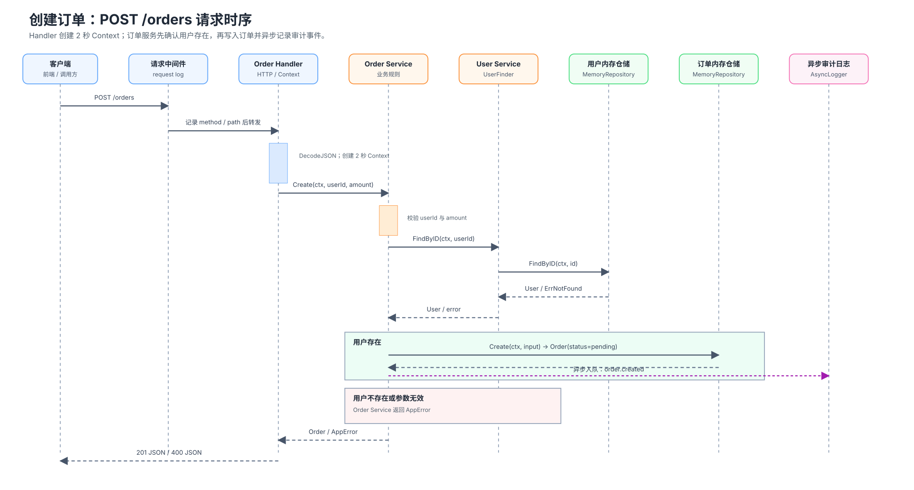
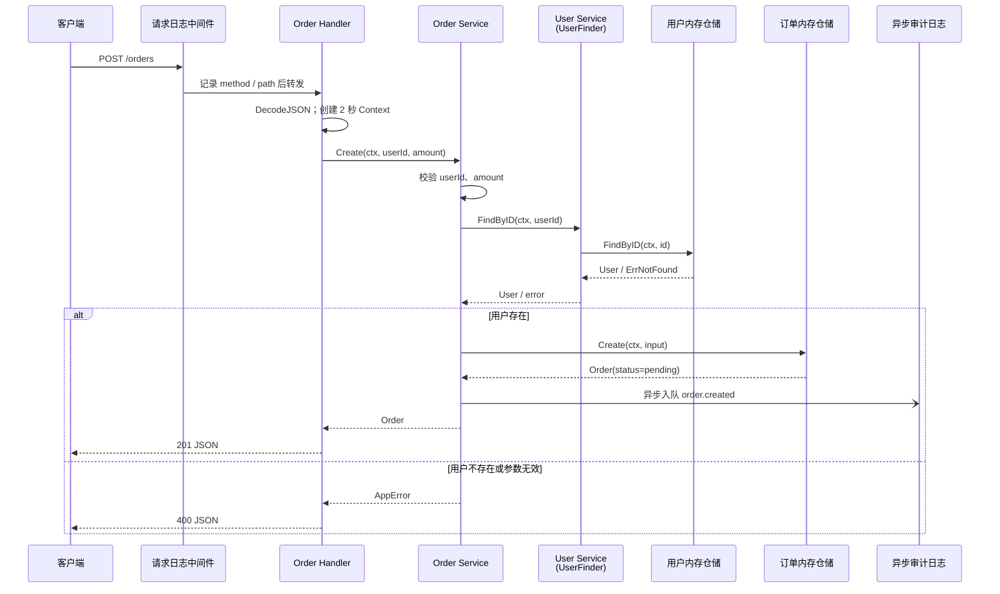

# 项目架构与依赖关系

本文基于当前代码实现说明 `user-order-api` 的启动流程、分层职责与模块依赖。

## 总览

项目是一个仅使用 Go 标准库的 HTTP API 服务。`cmd/api` 是程序入口，`newServer()` 是组合根：它创建具体实现，并将依赖注入到 handler 和 service 中。

查看可编辑的 Mermaid 源

实线表示运行时调用；虚线表示 `newServer()` 中的创建、注册和依赖注入。

## 关键依赖边界

- Handler 只负责 HTTP 协议：创建超时为 2 秒的 `context.Context`、解析请求、调用 service、写回 JSON 响应。
- Service 负责参数校验、业务规则和底层错误到 `httpx.AppError` 的转换。
- Service 依赖 repository 接口，而非内存实现；因此可在不改变 service 的情况下替换为数据库实现。
- `order.Service` 通过 `UserFinder` 接口依赖用户查询能力，而不直接访问用户仓储。
- `audit.Logger` 是共享端口，当前由 `AsyncLogger` 通过有界队列和固定 worker 异步写入结构化日志；队列满时最佳努力丢弃，并在关闭窗口内排空已入队事件。

## 订单创建链路

查看可编辑的 Mermaid 源

## 路由与能力

| 路由 | 方法 | Handler | Service 能力 |
| --- | --- | --- | --- |
| `/health` | `GET` | `server.go` 中的匿名 handler | 返回服务状态 |
| `/users` | `GET` / `POST` | `user.Handler` | 查询用户列表 / 创建用户 |
| `/users/:id` | `GET` | `user.Handler` | 查询用户详情 |
| `/orders` | `GET` / `POST` | `order.Handler` | 查询订单列表 / 创建订单，并校验用户存在 |
| `/orders/:id` | `GET` | `order.Handler` | 查询订单详情 |

## 运行时与外部依赖

- 模块为 `bridge-go/user-order-api`，要求 Go `1.25.3`。
- `go.mod` 没有第三方模块依赖；HTTP、JSON、日志、并发、上下文与内存数据结构都来自 Go 标准库。
- 用户和订单数据保存在进程内存中，服务重启后会清空；当前没有数据库、缓存、消息队列或外部 HTTP 服务。
