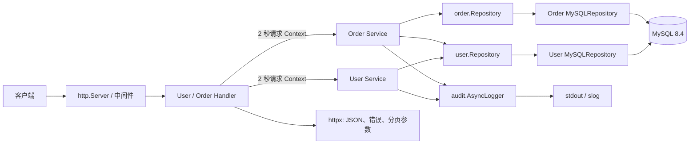

# 项目架构与依赖关系

`cmd/api/main.go` 是生产组合根：读取必填 `MYSQL_DSN`、建立并校验 MySQL 连接池、执行嵌入式向前迁移，然后将 MySQL 仓储注入 HTTP 应用。`newServer()` 只保留给内存仓储测试。

## 运行时调用链

## 启动与持久化

1. `main` 读取服务器超时和 `MYSQL_DSN`；DSN 缺失或数据库不可用时启动失败，不会回退到内存数据。
2. `database.Open` 建立 `database/sql` 连接池：最大连接 10、最大空闲 5、连接生命周期 30 分钟，并在 5 秒内完成 Ping。
3. `database.ApplyMigrations` 从二进制内嵌的 SQL 文件按文件名顺序执行尚未记录的迁移；DDL 成功后才写入 `schema_migrations`。迁移仅向前，遇错立即停止。
4. `main` 注入 `user.NewMySQLRepository` 和 `order.NewMySQLRepository`。优雅停机的实际关闭顺序为 HTTP → 审计日志 → 数据库连接池。

## 分层边界

- Handler 只处理 HTTP、请求超时、分页参数与 JSON 响应。
- Service 处理参数校验、业务规则及领域错误到 `httpx.AppError` 的转换。
- Repository 接口隔离存储实现；MySQL 仓储使用 `ExecContext`、`QueryRowContext`/`QueryContext`，内存实现仅服务测试。
- `order.Service` 通过 `UserFinder`（生产中为用户仓储）确认用户存在；外键冲突也会被转换为客户端可理解的“用户不存在”。
- `page.Request` 与 `page.Result[T]` 是存储无关的游标分页契约。查询按 `id ASC`，使用 `afterId` 和多取一条记录生成 `nextCursor`。

## 路由

| 路由 | 方法 | 成功响应 |
| --- | --- | --- |
| `/api/v1/health` | `GET` | `{ "status": "ok" }` |
| `/api/v1/users` | `POST` | 用户，`201` |
| `/api/v1/users` | `GET` | `{ "items": [...], "nextCursor": "..." }` |
| `/api/v1/users/:id` | `GET` | 用户 |
| `/api/v1/orders` | `POST` | 订单，`201` |
| `/api/v1/orders` | `GET` | `{ "items": [...], "nextCursor": "..." }` |
| `/api/v1/orders/:id` | `GET` | 订单 |

列表接口接受 `limit`（默认 20，范围 1–100）和正整数 `afterId`。没有下一页时省略 `nextCursor`。错误响应为 `{ "code": "稳定错误码", "error": "人类可读文案" }`；金额是人民币分整数，时间是 UTC RFC 3339。

## 外部依赖

- Go `1.25.3`
- `database/sql`
- `github.com/go-sql-driver/mysql`
- MySQL `8.4`（本地由 `compose.yaml` 提供）

创建订单的持久化时序见：[订单创建时序图](images/order-create-sequence.svg)。
