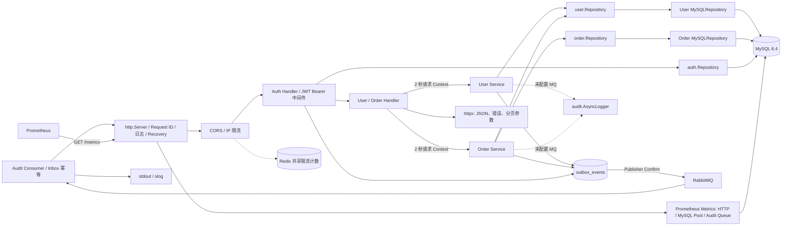

# 项目架构与依赖关系

`cmd/api/main.go` 是启动入口：读取必填 `MYSQL_DSN`、建立并校验 MySQL 连接池、执行嵌入式向前迁移，然后调用 `internal/app.NewProduction` 创建 HTTP 应用。`internal/app` 是唯一的应用组合根：负责选择内存或 MySQL 仓储，并组装 Auth、User、Order 的 Service、Handler、路由和中间件。


## 运行时调用链



## 启动与持久化

1. `main` 读取服务器超时和 `MYSQL_DSN`；DSN 缺失或数据库不可用时启动失败，不会回退到内存数据。
2. `database.Open` 建立 `database/sql` 连接池：最大连接 10、最大空闲 5、连接生命周期 30 分钟，并在 5 秒内完成 Ping。
3. `database.ApplyMigrations` 从二进制内嵌的 SQL 文件按文件名顺序执行尚未记录的迁移；DDL 成功后才写入 `schema_migrations`。迁移仅向前，遇错立即停止。
4. 若设置 `REDIS_ADDR`，`main` 在监听端口前 Ping Redis 并将计数器注入应用；Redis 不可用时启动失败。未设置时限流使用进程内存实现。
5. `main` 调用 `app.NewProduction`；该函数创建共享 `outbox.Repository`，并将其注入 user/order/auth MySQL Repository。每个业务写事务同时提交业务表与 `outbox_events`；认证数据与业务数据使用同一个 MySQL 数据库，会话只存 Refresh Token 的 SHA-256 哈希。
6. 配置 `RABBITMQ_URL` 后，应用启动时声明持久化 Exchange、审计队列、重试队列和 DLQ，并启动 Outbox Publisher 与 Inbox 幂等 Audit Consumer；未配置时保留本地 `AsyncLogger` 降级路径。
7. 若同时配置 `BOOTSTRAP_ADMIN_EMAIL`、`BOOTSTRAP_ADMIN_PASSWORD`，`app.NewProduction` 启动时仅在邮箱不存在时创建管理员。优雅停机的实际关闭顺序为 HTTP → Publisher/Consumer → RabbitMQ → 审计日志 → Redis → 数据库连接池。

## 三条组装路径

```text
运行应用：cmd/api/main.go → app.NewProduction → MySQL Repository → user_order_api
普通 HTTP 测试：internal/app/http_test.go → app.NewMemory → Memory Repository
MySQL HTTP 集成测试：internal/app/http_test.go → app.NewProduction → MySQL Repository → user_order_api_test（认证、会话撤销、A/B 订单归属与管理员权限）
```

测试库必须通过 `MYSQL_TEST_DSN` 指向专用的 `user_order_api_test`；未配置该变量时 MySQL 集成测试跳过。内存仓储只用于测试，不是生产数据库不可用时的回退路径。

## 分层边界

- Handler 只处理 HTTP、请求超时、分页参数与 JSON 响应。
- Service 处理参数校验、业务规则及领域错误到 `httpx.AppError` 的转换。订单服务还负责状态机和仅在实际变化时写入审计事件。
- Repository 接口隔离存储实现；MySQL 仓储使用 `ExecContext`、`QueryRowContext`/`QueryContext`，内存实现仅服务测试。订单创建以 `orders.idempotency_key` 的唯一约束防止并发重试重复写入；状态流转以 `WHERE status = 'pending'` 的条件更新保证原子性。
- `order.Service` 通过 `UserFinder`（生产中为用户仓储）确认用户存在；外键冲突也会被转换为客户端可理解的“用户不存在”。
- `page.Request` 与 `page.Result[T]` 是存储无关的游标分页契约。查询按 `id ASC`，使用 `afterId` 和多取一条记录生成 `nextCursor`。
- `auth` 负责 bcrypt 密码、短期 HS256 Access JWT、Refresh 会话轮换和退出撤销。每个受保护请求都会按 JWT 的 `sid` 查询会话；会话被退出或轮换撤销后，该 Access Token 的下一次请求立即返回 `401`。`principal` 平台包只承载请求身份上下文，避免认证模块与业务模块相互依赖。
- 普通用户只能读取自己的资料和订单；订单列表在仓储查询中按 `user_id` 过滤。`admin` 才能列出用户、跨用户查看订单或替其他用户创建订单。
- `security` 在 HTTP 外层执行精确 Origin CORS 和按 IP/路由类别的限流；配置 Redis 时通过 Lua 原子计数在多个实例间共享窗口，未配置时使用内存计数。生产 TLS 由反向代理终止，必须启用 `AUTH_COOKIE_SECURE=true`。
- `observability` 使用独立 Prometheus Registry 采集 HTTP 请求数、耗时、并发数、MySQL 连接池和审计队列状态。路由标签只使用有限模板，例如 `/api/v1/orders/:id`，不会记录订单 ID、用户 ID、邮箱、Token、请求 ID 或错误文本。
- `/healthz` 只表示 HTTP 进程可响应；`/readyz` 在两秒内 Ping MySQL 后才表示就绪；`/metrics` 供 Prometheus 抓取。三个端点都在根路径，不属于 `/api/v1` 的业务 API 契约。

## 本地容器运行

`docker compose up --build -d` 启动 API、MySQL、Redis、RabbitMQ、Prometheus、Jaeger 和 Alertmanager：`api` 提供 `8888` 端口，`mysql` 使用命名卷持久化并额外映射 `3307` 供 Navicat 本地查看，Redis 仅在 Compose 内部提供 `redis:6379`，RabbitMQ 提供内部 AMQP `5672` 和本地管理界面 `15672`，Prometheus 提供 `9090` 端口并每 15 秒抓取 `api:8888/metrics`。容器间通过 Compose 内部网络通信，API 的数据库地址为 `mysql:3306`。

## 路由

| 路由 | 方法 | 成功响应 |
| --- | --- | --- |
| `/api/v1/health` | `GET` | `{ "status": "ok" }` |
| `/api/v1/auth/register` | `POST` | 注册、设置 Refresh Cookie、返回 Access Token，`201` |
| `/api/v1/auth/login` | `POST` | 登录、设置 Refresh Cookie、返回 Access Token，`200` |
| `/api/v1/auth/refresh` | `POST` | 轮换 Refresh 会话并返回新 Access Token，`200` |
| `/api/v1/auth/logout` | `POST` | 撤销 Refresh 会话；该会话的 Access Token 随即失效，`204` |
| `/api/v1/auth/me` | `GET` | 当前用户公开资料 |
| `/api/v1/users` | `POST` / `GET` | 仅 `admin` |
| `/api/v1/users/:id` | `GET` | 本人或 `admin` |
| `/api/v1/orders` | `POST` | 已认证创建；普通用户自动绑定自身，`admin` 可指定用户 |
| `/api/v1/orders` | `GET` | 普通用户自己的订单；`admin` 全量 |
| `/api/v1/orders/:id`、`/pay`、`/cancel` | `GET` / `POST` | 订单所有者或 `admin` |

| 运维路由（根路径） | 方法 | 成功响应 |
| --- | --- | --- |
| `/healthz` | `GET` | 存活，`{ "status": "ok" }` |
| `/readyz` | `GET` | MySQL 就绪时为 `200`；不可用为 `503 { "status": "not_ready" }` |
| `/metrics` | `GET` | Prometheus 文本格式指标 |

列表接口接受 `limit`（默认 20，范围 1–100）和正整数 `afterId`。没有下一页时省略 `nextCursor`。创建订单可选 `Idempotency-Key` 请求头：同键同参数重试返回首次订单，冲突返回 `IDEMPOTENCY_KEY_CONFLICT`。状态机只允许 `pending -> paid` 或 `pending -> cancelled`，跨终态操作返回 `INVALID_ORDER_STATE`。错误响应为 `{ "code": "稳定错误码", "error": "人类可读文案" }`；金额是人民币分整数，时间是 UTC RFC 3339。

## 外部依赖

- Go `1.25.3`
- `database/sql`
- `github.com/go-sql-driver/mysql`
- `github.com/golang-jwt/jwt/v5`
- `github.com/prometheus/client_golang`
- `github.com/redis/go-redis/v9`
- `golang.org/x/crypto/bcrypt`
- MySQL `8.4`（本地由 `compose.yaml` 提供）
- Prometheus `3.5.0`（本地由 `compose.yaml` 提供）
- Redis `7.4`（本地由 `compose.yaml` 提供，仅用于共享限流计数）
- RabbitMQ `4-management-alpine`（本地由 `compose.yaml` 提供，用于 Outbox 异步投递）

创建订单的持久化时序见：[订单创建时序图](images/order-create-sequence.svg)。
